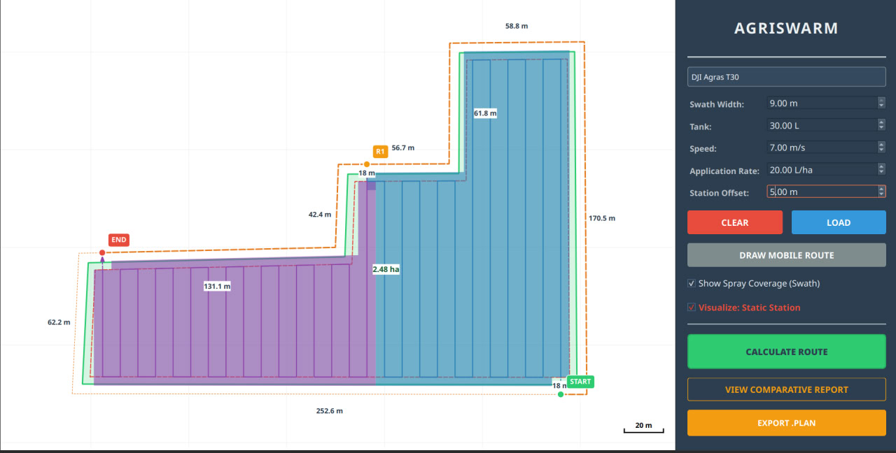
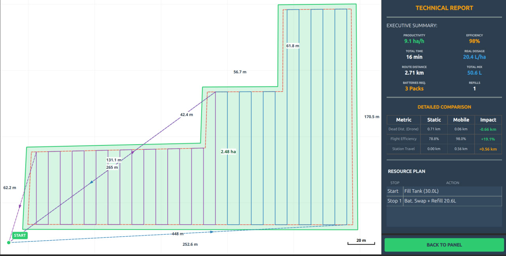

# AgriSwarm Planner

**Mission Planning System for Cooperative Agricultural Robotics**

AgriSwarm Planner is a desktop application developed to plan, optimize, and visualize cooperative missions involving Agricultural UAVs (Unmanned Aerial Vehicles) and Mobile Charging Stations (UGVs).

This software serves as a practical implementation and validation of advanced coverage path planning (CPP) algorithms for precision agriculture.





## Scientific Basis

The core algorithms implemented in this project are strictly based on the methodologies proposed in the following research papers:


1.  **"Coverage Path Planning Method for Agricultural Spraying UAV in Arbitrary Polygon Area"**
    *   *Implementation:* Concave Polygon Decomposition and Convex Boustrophedon Path Generation (Phase 1-3).
    *   *Key Contribution:* Enabling efficient flight operations in irregulary shaped fields by decomposing them into optimal convex sub-regions.

2.  **"Coverage Path Planning Optimization of Heterogeneous UAVs Group for Precision Agriculture"**
    *   *Implementation:* Cooperative logistics and resource synchronization (Phase 4).
    *   *Key Contribution:* Integrating a mobile ground station to minimize non-productive flight time (deadheading) and optimize battery/tank swap cycles.

## Key Features

### Advanced Path Planning
-   **Convex Decomposition**: Implements a recursive algorithm to decompose arbitrary concave polygons into convex sub-regions, eliminating Type-1 and Type-2 concavities that obstruct efficient flight paths.
-   **Optimal Flight Direction**: utilizes a Genetic Algorithm (GA) to determine the optimal sweep angle for each sub-region, minimizing total turning maneuvers and flight distance.
-   **Boustrophedon Paths**: Generates continuous back-and-forth coverage paths optimized for the kinematic constraints of agricultural drones.

### Cooperative Logistics
-   **Mobile Station Synchronization**: Plans the trajectory of a ground vehicle (truck) that moves along the field boundary to serve as a mobile landing platform.
-   **Energy & Flow Management**: Calculates precise rendezvous points based on the drone's battery discharge curve and liquid flow rate, ensuring safe return before resource depletion.
-   **Efficiency Analysis**: Provides comparative metrics between Static Station operations vs. Mobile Station operations, quantifying gains in field efficiency and reduction in deadhead distance.

### Visualization & Simulation
-   **Interactive Interface**: A PyQt6-based graphical interface for real-time visualization of field boundaries, flight paths, spray coverage, and truck routes.
-   **Mission Profiling**: Detailed inspection of mission cycles, including specific coordinates for start/end points and resource consumption per cycle.

## Technology Stack

-   **Language**: Python 3.10+
-   **GUI Framework**: PyQt6
-   **Computational Geometry**: Shapely, NumPy
-   **Architecture**: Model-View-Controller (MVC)

## Project Architecture

The system is architected using the **Model-View-Controller (MVC)** design pattern to ensure separation of concerns, modularity, and scalability. The core algorithmic logic is decoupled from the user interface.

### Directory Structure & Design Patterns

```
agriswarm_planner/
├── src/
│   ├── algorithms/          # MODEL (Core Logic)
│   │   ├── decomposition.py #   - Concave Polygon Decomposition (Phase 2)
│   │   ├── genetic_optimizer.py # - Genetic Algorithm Engine (Phase 4)
│   │   ├── segmentation.py  #   - Logistics Segmentation (Phase 5)
│   │   ├── strategy.py      #   - Strategy Pattern Interface
│   │   └── ...
│   │
│   ├── controllers/         # CONTROLLER
│   │   └── mission_controller.py # - Façade orchestrating UI inputs and Algorithms
│   │
│   ├── gui/                 # VIEW
│   │   ├── map_widget.py    #   - Custom QGraphicScene for visualization
│   │   ├── report_window.py #   - Analytics Dashboard
│   │   └── ...
│   │
│   └── utils/               # SHARED UTILITIES
└── main.py                  # Entry Point
```

**Key Design Patterns Applied:**

*   **Strategy Pattern (`src/algorithms/strategy.py`)**: Defines a common interface (`MissionPlannerStrategy`) for path planning algorithms. This allows the system to switch dynamically between different optimization strategies (e.g., Genetic Algorithm, Grid Search) without modifying the controller logic.
*   **Façade Pattern (`src/controllers/mission_controller.py`)**: Provides a simplified interface to the complex subsystem of algorithms (Decomposition -> GA -> Segmentation), making the system easier to use for the GUI layer.

## Installation

### Prerequisites
-   Python 3.8 or higher

### Setup

1.  Clone the repository:
    ```bash
    git clone https://github.com/yourusername/agriswarm_planner.git
    cd agriswarm_planner
    ```

2.  Create a virtual environment:
    ```bash
    python -m venv venv
    # Linux/Mac
    source venv/bin/activate
    # Windows
    venv\Scripts\activate
    ```

3.  Install dependencies:
    ```bash
    pip install -r requirements.txt
    ```

## Usage Procedures

1.  **Launch the System**:
    Execute the entry point script:
    ```bash
    python main.py
    ```

2.  **Field Definition**:
    Define the field boundary interacting with the map. The system supports complex concave polygons.

3.  **Parameter Configuration**:
    Select the UAV model and configure critical operation parameters:
    -   Swath Width (m)
    -   Safety Buffer (m)
    -   Tank Capacity (L)
    -   Battery Endurance (min)

4.  **Algorithm Execution**:
    Initiate the calculation. The system will sequentially execute:
    -   Geometry validation and buffering.
    -   Convex decomposition.
    -   Genetic optimization for path angle.
    -   Logistics segmentation.

5.  **Results Analysis**:
    Review the generated path and access the "Comparative Report" to evaluate the operational efficiency metrics.

## License

This project is open-source and available under the MIT License.